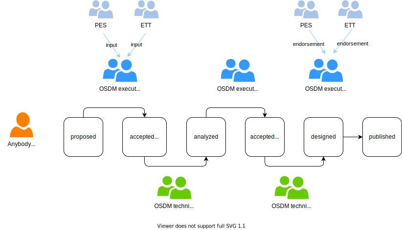

## Evolution Process

As customer and business **needs change**, the specification needs to evolve
continuously. To address the need for improvement the project has been setup in
an **agile manner**.

### Basic Concepts

A specification as a **product** which is managed as follows:

- We have a backlog of improvements where everybody can contribute.

- An improvement addresses a need and solves a problem, thus producing **value**.

- The **Sales Progress Group (SPG) Working group (NRT/IRT/NT groups)** identifies
  the business needs on behalf of the railway undertakings. The business representatives
  prepare the new requirements with Chairs of OSDM technical Working group. The output
  is a functional specification document to be examined by the **Personal Expert Subgroup
  (PES)** (input). On the side the distributors' side, the business needs are identified
  by **Eu Travel Tech (ETT)** representatives.

- The **OSDM executive committee** (Chair: [Marc Guigon](https://www.linkedin.com/in/marcguigon/) &
  [Vittorio Carta](https://www.linkedin.com/in/vittorio-carta-mba-0b90b728/)) prioritizes the
  backlog based on the value for the **railway customer** and the **railway sector** as a whole.
  The committee is a **fair representation** of the parties involved, thus railways and
  distributors and others.

- The **OSDM technical working group** (Chair: [Clemens Gantert](https://www.linkedin.com/in/clemens-g-88783725/) &
  [Andreas Schlapbach](https://www.linkedin.com/in/andreas-schlapbach-09b095ab/)) designs and
  implements improvements to the standard. Thus, it is responsible to translate the
  functional specification identified by the SPG/PES and ETT into a document of
  technical specification. To stay focused, the work in progress should not be larger
  than seven items. The working group takes special care not to break existing
  implementations, thus **securing investments** made by all the parties.

- The **PES** endorses the functional and technical specifications prepared by the
  OSDM Technical WG, preparing the agenda of the OSDM executive committee. Similarly,
  **ETT** endorses the improvements prepared.

Illustration of the concepts:

### Structure of an Improvement

An improvement is structured similar to an [epic](https://www.scaledagileframework.com/epic/)
in the [SAFe](https://www.scaledagileframework.com/) framework as follows:

- **Name**: Short name for the improvement

- **Owner**: Name of the owner

- **Description**
  "For _customers_ who _do something_ the _solution_ is a _improvement_
  that _provides this value_ unlike _current solution or non-existing solution_
  our solution _does something better_."

- **Business Value**: The business value which is generated after the improvement
  has been implemented (low/middle/high).

- **Business Outcomes**: The measurable benefits that the business can anticipate if the epic
  hypothesis is proven to be correct.

- **Leading Indicators**: The early measures that will help predict the business outcome
  hypothesis.

- **Non-functional Requirements**: If a business requirement has critical non-functional
  constraints they should be noted here.

- **Specification Effort**: An assessment of the effort to specify the improvement
  (_EXTRA_SMALL_, _SMALL_, _MEDIUM_, _LARGE_, _EXTRA_LARGE_).

### State of an Improvement

An improvement takes the following steps:

- An improvement is in the initial state **proposed**.
- The steering board then decides which improvements to analyze based on their
  business value → state **accepted for analysis**.
- The technical experts then analyses the improvement and determine its
  complexity (low/middle/high). After their work the improvement is in state
  **analyzed**.
- The steering board decides which improvements are to be implemented based on
  a **transparent** prioritization model (e.g. Weighted Shortest Job First) →
  state **accepted for design**.
- The technical experts then design the solution, thus the API, the
  documentation and the test sets. After their work the improvement is in state
  **designed**.
- The steering board releases **major, i.e. breaking changes** → the
  improvement is **published**.

## Working Mode

The technical working group meets online every Friday from 9:00 to 11:00.
Participation is open to everybody and highly encouraged. If you wish to join, please
contact [Schlapbach Andreas](https://www.linkedin.com/in/andreas-schlapbach-09b095ab/).

The meeting minutes as well as future improvements are documented in the
[GitHub Wiki](https://github.com/UnionInternationalCheminsdeFer/OSDM/wiki).

## Road Map

The specification, i.e., the product is improved in fixed-length time boxes similar to
a [program increment](https://www.scaledagileframework.com/program-increment/)
in the [SAFe](https://www.scaledagileframework.com/) framework.

The following increments are planned:

| Product Increment |  End Date  | State                                                                                                   |
| ----------------- | :--------: | ------------------------------------------------------------------------------------------------------- |
| `PI-0`            | 17.12.2020 | _delivered with ODSM v.1.0_                                                                             |
| `PI-1`            | 11.02.2021 | _delivered with OSDM v.1.1_                                                                             |
| `PI-2`            | 24.06.2021 | _delivered with OSDM v.1.2_, see [Release Notes 1.2](https://osdm.io/releases/OSDM-release-notes-v1.2/) |
| `PI-3`            | 28.10.2021 | _delivered with OSDM v.1.3_, see [Release Notes 1.3](https://osdm.io/releases/OSDM-release-notes-v1.3/) |
| `PI-4`            | 14.02.2022 | _delivered with OSDM v.1.4_, see [Release Notes 1.4](https://osdm.io/releases/OSDM-release-notes-v1.4/) |
| `PI-5`            | 24.06.2022 | _OSDM v.1.5 is being bundled_                                                                           |
| `PI-6`            | 28.10.2022 | _specification on OSDM v.1.6 ongoing_                                                                   |
