## Common Data Structures in Offline and Online Mode

The following chapters contain the detailed description of data structures used to describe fares.

The data structure definitions are used in the bulk data exchange and the online services. The requirements listed in chapter “Requirements” reference the data structures that implement the requirement.

### General

The following general data types shall be used:

- DateTime Formats: Date time values must be encoded according to  RFC 3339, section 5.6.
- Station Codes: Station codes must be taken from the MERITS code list.
- Station Names: Station names should not include ”/”,”*”. These characters are used to define routes and alternative routes in route descriptions.

### Versioning

The specification (open api specification and schema files for offline data) are published as mayor versions in case they are not interoperable. Minor versions will include interoperable changes on the data structure which also includes providing additional data elements that are optional. Implementers must be able to ignore additional elements.

Minor minor versions will include additional documentation only.

### Indication of personal data

Within the online part the required personal data are indicated. The general grammar
to indicate required data is used.

### Indication of required data

Required data are indicated in a structured way using the following language:
Data elements are indicated by their path to the resource separated by dots:

- `passenger.gender`
- `passenger.email`
- `passenger.phoneNumber`

The required data elements can be combined using the logical operators:

- `AND`
- `OR`

Brackets  `(` and `)` can be used in the standard way as for logical expressions, e.g.:
`passenger.gender AND (passenger.email OR passenger.phoneNumber)`

#### Detailed data structures

The data structures to be used are defined in the schema and open api specification files. This section serves as additional documentation only.

### AfterSalesRules

After sales conditions define fees to be taken in case of an after sales transaction on behalf of a customer. The after sales transactions considered are:

- Cancellation (= Refund)
- Exchange with a new fare of the same carrier
- Exchange with a new fare of another carrier
- Upgrade

See code list: `TransactionType`

The after sales rules might include rules for a delayed payment to avoid fraud. This might depend in the type of fulfillment. (e.g. no cash refund on electronically payed tickets, no refund unless ticket control data have been received, …).

The refund fee can be claimed by the carrier.

The after sales rules bundle a set of after sales conditions under an id that can be referenced by a fare.

An after sales condition applies for a set of after sales transactions and specified:

- the fee to be applied
- the time when the fee needs to be applied
- whether the fee needs to be given to the carrier or can be kept by the allocator
- The data include the amount to be refunded. The amount is given to avoid any calculations with complex rules (percentage + minimum / maximum value) at the allocator side.:
- The value and currency to be applied
- A percentage for customer information. Due to rounding errors a calculated percentage could result in strange numbers (e.g. 9.99% instead of 10%)
- The unit on which the value is calculated (travellers or bookings)
The time when the fee needs to be applied is defined by:
- The time unit (hours, minutes, ...)
- The time difference value
- The time reference (before departure…)

See code lists: `TimeReference`, `TimeUnit`

An after sales fee is applied from a time before departure, after sale,..)

In case multiple rules apply to the same after sales transaction the rule with the closest time in the future must be applied.

#### Data Constraints on AfterSaleRule

| Code | Description |
|---|---|
| `fee/feeRef` | In online services a fee is included directly, in bulk data exchange a fee must be included in the list of prices and referenced by an id. The fee provided must include the currency € if not agreed bilaterally otherwise. |
| `applicationTime` / `applicationTimeStamp` | An application time stamp can be used in online services only. If an application time stamp is provided the allocation Time as relative time must not be included.

### Calendar

A Calendar is referenced by a unique id which can be referenced from other data structures linked to the fare.
A Calendar defines a list of days between two dates. If the dates are not provided in UTC the offset to UTC must be provided additionally.

<!-- Figure 4 Calendar data structure -->

#### Data Constraints on Calendar

| Code | Description |
|---|---|
| `fromDate`, `untilDate` | fromDate and untilDate must be provided and `fromDate <= untilDate`
| `dates` | `fromDate` <= `date` <= `untilDate`

### CarrierConstraint

The carrier constraint can be referenced by a fare via the id.

Carrier constraint limits an open fare - not linked to a train - to some carriers. The carriers can
be specified either as exclusion list or alternatively as inclusion list.

Carriers are specified by their Company code (RICS code).

The included / excluded carriers are also part of the FCB barcode (*IRS 90918-4*) content and the ticket
control data (*IRS 90918-9*).

The offline data structure includes an additional id to reference the constraint within a fare data delivery.

<!-- Figure 5 carrier constraint data structure (offline) -->

#### Data Constraints on CarrierConstraint

| Code | Description |
|---|---|
| `includedCarriers/excludedCarriers` | Either a list of included or a list of excluded carriers must be provided. It is not allowed to provide both lists.|

### ConnectionPoint

A connection point defines a point where two regional validities of different carriers
can be connected. A connection point is implemented as the list of stations which hit
connects.

In case a route ends at a real station the connection point includes the real station.

In case the combination is not at a real station an indication is needed to define the allowed combinations. This could be done by listing the next stations of other carriers which would allow a combination. Combinations would be allowed if the combination points of two routes share two common stations.

This would also work with multiple stations.

Connection points will include a border point code to support existing implementations where the border point code is compared with the timetable data. As in principle every station can become a connection point (e.g. all stops from Aachen to Brussels are connection points from `DB` to `SNCB`) implementations based on border point codes cannot cover all connections.

As on both sides of a connection multiple small stations could be connected and not all of them might be in the timetable of a train the connections point should allow to connect sets of stations.

1. Two fares can be connected in case their connection points share a common station in the provided station sets if only one set is provided by a connection point.
2. Two fares can be connected in case their connection points share a common station in two if the provided station sets of each connection point.

<!-- Figure 6 connection points - simple case 1 -->

<!-- Figure 7 connection points - complex case 2 -->
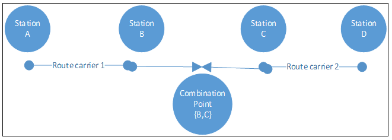

The online data structure does not include the id and the legacy code.

<!-- Figure 8 ConnectionPoint data structure offline -->

#### Data Constraints on ConnectionPoint

| Code | Description |
|---|---|
| `stationSets` | At least one set with one station must be provided in case the fare border is a real station. Two station sets must be provided in case the fare border is between two real stations. |
| `legacyBorderPointCode` | The legacy border point code must be provided for the time being. New implementations should not use the border point code. |

### Fare

An elementary fare to create an offer linking all constraints to one price.

| Data elements | Description |
|---|---|
| `fareType` | **NRT**, **IRT**, **Ancillaries** , **Reservations**
| `name` | Name of the fare
| `fareDetailDescription` | Additional explanation on the fare (e.g. on included fees like Diabolo or Venice fee).
| `price` | Price with currency € must be provided if not otherwise agreed bilaterally.
| `regionalConstraint` | Definition of the regional validity of the fare and the geographical combination rules (connection points).
| `serviceConstraint` | Restrictions of the service allowed to be used.
| `carrierConstraint` | Restriction on the carriers that can be used with the fare.
| `serviceClass` | Class the passenger can use.
| `serviceLevel` | Mode detailed category of places the passenger can use.
| `passengerConstraint` | Rules and restrictions on the passenger types allowed to use the fare and rules on combining passengers.
| `afterSalesRules` | After sales rules for the fare. In case the allocator is responsible for the after sales rules this is almost empty.
| `combinationConstraint` | Rules on the model of combination of this fare with fares of other carriers.
| `fulfillmentConstraint` | Restrictions and requirements on the fulfillment and security to be applied by the allocator.
| `reductionConstraint` | Rules on reduction cards necessary to apply the fare.
| `reservationParameter` | Information on parameters for reservation via the *IRS 90918-1* interface and reservation options.
| `regulatoryConditions` | Legal regimes to be applied to the fate (e.g. `COTIV`, `SMPS` regulations).
| `personalDataConstraint` | Rules on the personal data to be provided in a booking.
| `legacyAccountingIdentifier` | Data to be included in the current *IRS 30301* accounting data format.
| `salesAvailabilityConstraint` | Rules on the allowed sates dates for the fare.
| `travelValidityConstraint` | Rules on the validity for travel of this fare.
| `legacyConversion` | Defines whether this fare is allowed to be converted to the old 108.1 data structure and used according to the old rules (`YES`, `NO`, `ONLY` (this fare is provided for conversion only)).

<!-- Figure 9 Fare element data structure (online) -->

#### Data Constraints on Fare

| Code | Description |
|---|---|
| `price` | A price must be provided for all offline fares including those where the price is zero. |
| `legacyAccountingIdentifier` | In case *IRS 30301* in the current version is used to accounting these data must be provided for offline fares |
| `serviceClass` | Must be provided for offline fares
| `combinationConstraint` | Must be provided for offline fares
| `travelValidityConstraint` | Must be provided for offline fares
| `salesAvailabilityConstraint` | Must be provided for offline fares

### FareCombinationConstraint

The fare combination constraint defines the rules of combining fares from different carriers. It provides a list of combination models the allocator can choose of.

| Content | Description |
|---|---|
| `model` | Code of the combination model applied
| `combinableCarriers` | List of carriers that can be combined with this fare. If empty, there is no restriction in combining different carriers. Carriers are listed by their RICS company codes.
| `onlyWhenCombined` | Indicates that this fare can be used only if it is combined with another fare of another carrier.
| `referenceCluster` | Cluster within the clustering model to which this fare belongs
| `allowedClusters` | List of clusters with which this fare can be combined
| `allowedAllocators` | List of allocators which can combine this fare. . . If empty, there is no restriction in combining different carriers. Carriers are listed by their RICS company codes. Allowed allocators is not present in the online data. |
| `allowedCommonContracts` | List of Carriers with which the allocator can for a common contract. If empty, there is no restriction in indicating common contracts to the passenger except for the `SEPARATE_CONTRACT` model. Carriers are listed by their RICS company codes.|

<!-- Figure 10 fare combination constraint data structure -->
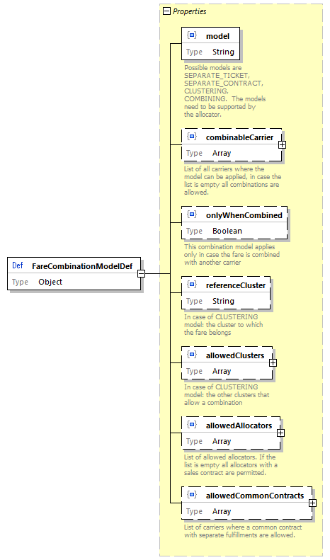

<!-- Figure 11 fare combination constraint data structure -->

#### Combination Model

##### SEPARATE_CONTRACT Model

This `SEPARATE_CONTRACT` model is the model for not combining the fares in one ticket and not allowing
the integration in one contract. The rules applied for this ticket are exactly the rules defined by the
carrier in the fare data.

The allocator must ensure that it is clear for the customer that no common contract was established.

##### CLUSTERING Model

The `CLUSTERING` model tries to simplify conditions and fares for the customer but sacrifices a part of
the control of the carrier on his fares.

Similar types of fares are defined to belong to the same cluster. The after sales conditions for a cluster
are defined by the allocator. However, the after sales conditions must basic rules on after sales for that cluster.

The clusters correspond to the flexibility a passenger receives to change the booked train. This corresponds directly
to the after sales conditions. Hereby the fees to be paid for such an exchange are essential for the definition of
clusters and not the complexity of the process to change. Thus, a train bound ticket and an open ticket belong to the
same cluster in case the fees to change to different trains / times are comparable.

The after sales fees can be demanded by the carrier.

The other conditions might either be listed per carrier or combined by rules.

The customer buying products from one allocator has a simple unique view on after sales conditions.

The basic parameters defining the price must be obeyed individually within separately on the combined fare/offer:

- route description / train link
- class of service
- passenger types

##### COMBINING Model

The `COMBINING` model tries to be close to the fare conditions defined by the carrier but sacrifices the simplicity
of the fare towards the customer.

The after sales conditions of the different fares will be combined into one condition to reflect the conditions of
all included carriers.  

The after sales conditions will thus depend on the combinations of carriers.

At any time, the after sales fees defined by the carriers are applied on the price part of these carriers only.
The result is a list of times with increasing fees.

###### COMBINING Model Example

- Carrier 1: 10% 20 days before departure. Price: 100€
- Carrier 2: 90% 2 days before departure. Price: 200 €
- Result:  
  - 10€ fee: 20 days before departure
  - 190€ fee: 2 days before departure

#### Additional Clustering Model Data

Fare clusters reflect the flexibility a fare provides to the customer. Flexibility is defined by the after sales conditions that apply when a passenger wants to change his ticket.

| Fare cluster code | description |
|---|---|
| `BUSINESS` | Refundable/Exchangeable after the departure or last day of validity |
| `FULL_FLEX` | Refundable/Exchangeable before the departure or last day of validity |
| `SEMI_FLEX` | Refundable/Exchangeable with fee depending on conditions of the allocator. Minimum validity applies |
| `NON_FLEX` | Non refundable. Non exchangeable. Minimum validity applies|
| `PROMO` | Used on a bilateral basis only. Non refundable. Non exchangeable. Minimum validity applies|

Combinations of fares of different clusters is allowed with the fare clusters listed in `allowedClusters`.
However not all combinations would be provided to the customer. A fare will be combined with a fare of
the same cluster and in case his is not available with one of the higher clusters.

##### Clustering Model Example

- Carrier 1:

  - `BUSINESS` -> CombinableClusters: `BUSINESS`, `FULL_FLEX`, `SEMI_FLEX`, `NON_FLEX`
  - `SEMI_FLEX` -> CombinableClusters: `SEMI_FLEX`, `NON_FLEX`

- Carrier 2:

  - `BUSINESS` -> CombinableClusters: `BUSINESS`, `FULL_FLEX`, `SEMI_FLEX`, `NON_FLEX`
  - `FULL_FLEX` -> CombinableClusters: `FULL_FLEX`, `SEMI_FLEX`, `NON_FLEX`

Possible combined offers are:

- `BUSINESS` (Carrier 1 `BUSINESS` + Carrier 2 `BUSINESS`)
- `FULL_FLEX` (Carrier 1 `BUSINESS` + Carrier 2 `FULL_FLEX`)
- `SEMI_FLEX` (Carrier 1 `SEMI_FLEX` + Carrier 2 `FULL_FLEX`)

A `NON_FLEX` would be formally allowed, but with the same price as the `SEMI_FLEX` so
it should not be shown to the customer:

- `NON_FLEX` (Carrier 1 `SEMI_FLEX` + Carrier 2 `FULL_FLEX`)

Other combinations would also be formally allowed by the data but suppressed as they
would only offer a higher price. These should be suppressed by the allocator. E.g.:

- `FULL_FLEX` (Carrier 1 `BUSINESS` + Carrier 2 `BUSINESS`)

#### Data Constraints on FareCombinationConstraint

| Code | Description |
|---|---|
| `combinationModel` | At least one model must be provided |

### FareResourceLocation

Fare resource location provides data on where to find online services for fares.
The fare location provides three options:

- Link a resource to a carrier – the carrier must be known from the timetable
- Link a resource to the train – the data must be updated in case of new trains
- Link a resource to stations:
  - The link can be made for stations and for connection points
  - The link is valid if start and end station (or connection points) provide the link

The online link provides information on:

- The type of resource either for a whole train of an area. In case of a train the
  request must be for the train route between stations (e.g. IRT), whereas for areas
  there might be multiple splits in-between a train run (e.g. NRT).

<!-- Figure 12 FareResourceLocation data structure -->
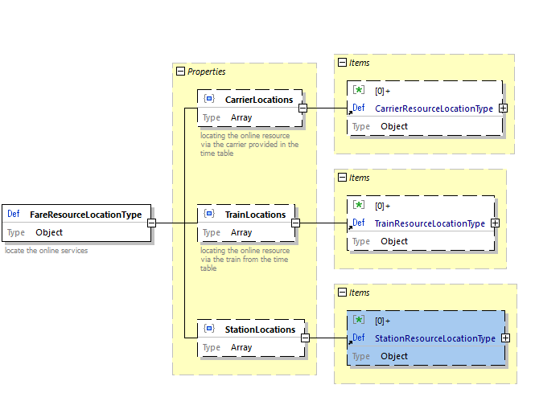

<!-- Figure 13 FareResourceLocation data structure - carrier link -->

<!-- Figure 14 FareResourceLocation data structure - train link -->
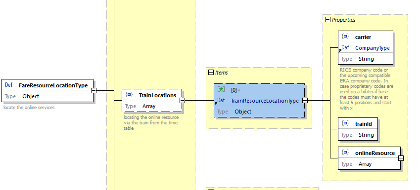

<!-- Figure 15 FareResourceLocation data structure - station link -->
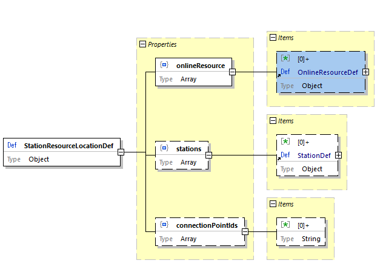

<!-- Figure 16 FareResourceLocation data structure - online resource -->

#### Graphics Icons

Graphic icons are used to display a coach including its facilities based on the coach layout and availability of places. The graphical items include frames and icons to display seats etc. Graphical items must be provided by the sales application of the issuer application to ensure a unique look and feel of the application.

The coach layout provides only the position of graphic items (co-ordinates) not the graphical presentation at the sales application (pictures).

A large table spans two places, whereas a small table spans only one place. A small wall spans two places and a large wall spans 3 places. A very small wall spans one place only.

#### Data constraints on FareResourceLocation

| Code | Description
|---|---|
| `System`| For reservation interface 90810-1 the reservation system code is used.

### FareReferenceStationSet

The fare reference station set defines a set of stations where the fare is valid for
all included stations.  This set can be used in the regionalValidity description.

The corresponding bar code ab ticket control data will only contain the code of the
station set, but the allocator needs the complete list of station to link the fare to
the train routes.

A name can be provided.

The station set is referenced by the company code of the fare provider and a code unique within the fare provider.

A `legacyCode` can be provided to include the current code in the 108.1 data.

<!-- Figure 17 FareReferenceStationSet Definition data structure -->
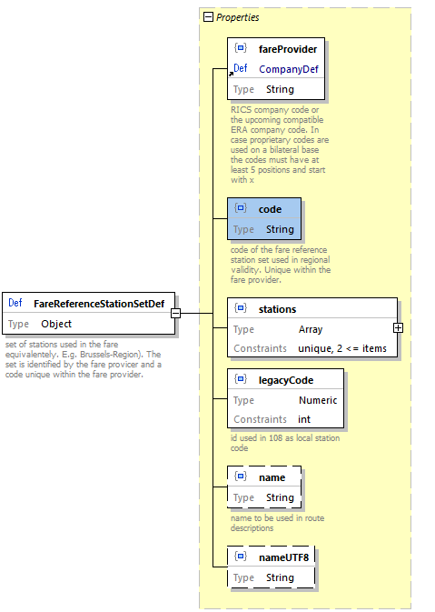

#### Data Constraints on FareReferenceStationSet

| Code | Description |
|---|---|
| `legacyCode` | A legacyCode must be provided for the time being. New implementations should not rely on that code. |
| `name` | The name should not include ”/”.”*”. |

### FulfillmentConstraint

The fulfillment constraint limits the applicable types of fulfillment and defined whether
control data need to be transferred via a standard interface (*IRS 90918-4*).

<!-- Figure 18 Fulfillment constraint data structure -->

Code lists for required `SiS`: `CardType`

The following code list defines the card types for cards used

| Predefined Card-Ids | Description |
|---|---|
| `LOYALTY_CARD` | Loyalty card |
| `REDUCTION_CARD` | Card providing reduction |
| `PASS` | Pass for travelling |

`ControlDataExchangeType`:

- for bar codes: `BarcodeType`
- for fulfillment: `ControlSecurityType`

#### Data Constraints on FulfillmentConstraint

| Code | Description |
|---|---|
| `acceptedFulfillmentType` | At least one accepted fulfillment type must be provided

### Line

Line defines the regional validity on a specific line. It might have additional restrictions to enter or leave at specific stations or to be used within an area or city only.

<!-- Figure 19 Line data structure -->

### PassengerConstraint

Passenger constraint defines restrictions of a fare concerning passengers. In online services the structure is reduced to constraints that need to be passed on for control to bar codes and control registries.

<!-- Figure 20 PassengerConstraint data structure offline -->
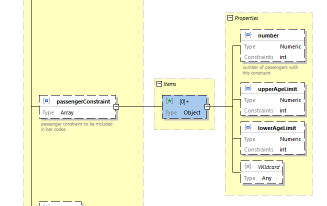

#### Data Constraints on PassengerConstraint

| Code | Description |
|---|---|
| `upperAgeLimit`, `lowerAgeLimit` | `upperAgeLimit` >= `lowerAgeLimit` |

### PersonalDataConstraint

Specification of personal data to be delivered to the carrier. Personal data might be included in:

- Booking service (OSDM and/or *IRS 90918-1*)
- Control data (bar code and/or control data delivery *IRS 90918-4*)

The requirement for personal data might depend on the type of fulfillment or on specific border crossings.

| Code | Description |
|---|---|
| `acceptedReason` | Accepted reason to change personal data after booking confirmation. See code list: Personal data change reasons |
| `transfer` | The way the personal data are transferred. See code list:  Personal data transfer types |
| `ticketHolderOnly`| Personal data are required for the ticket holder only |
| `dataItem` | Code of the data item required. Consists of `languageCode`, `overruleCode` (see below) and personal data items. |

#### Overrule Code

| Code | Description |
|---|---|
| `STRIKE` | Refund due to strike |
| `SALES_STAFF_ERROR` | Refund due to an error made by the sales staff |
| `PAYMENT_FAILURE` | Refund as the payment failed |

<!-- Figure 21 Required Personal data structure -->

<!-- Figure 22 allowed changes on personal data -->
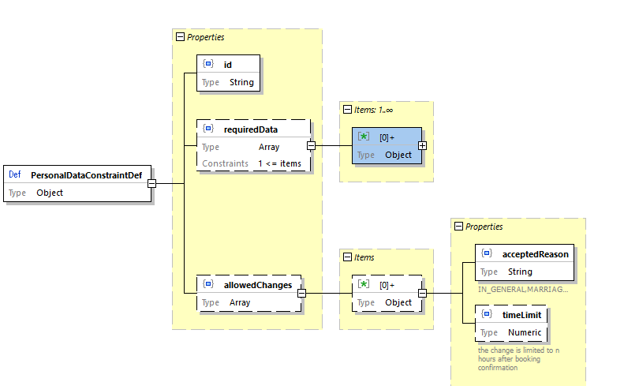

<!-- Figure 23 cross border conditions for personal data -->
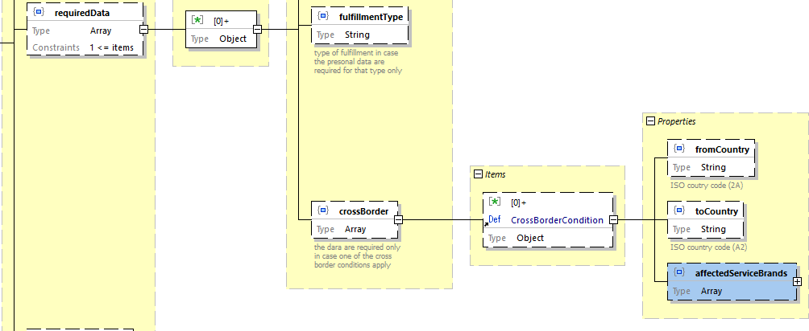

### Price

The price data structure provides the price or a fee including the VAT details optionally in different currencies.

<!-- Figure 24 Price data structure with a list of currency prices -->

<!-- Figure 25 Price data structure of one currency -->
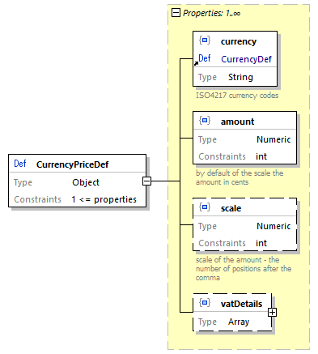

<!-- Figure 26 VAT details within a price -->
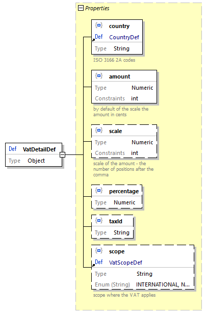

Scope: see code list TaxScope

#### Data Constraints on Price

| Code | Description |
|---|---|
|`amount`|`Amount` >=  `sum of VAT-amounts`

### ReductionCard

The reduction cards of a carrier are listed in the bulk data.

#### List of Carrier Cards

| Code | Description |
|---|---|
| `id` | Unique id of the card. The id must start with the RICS code of the carrier
| `name` | Name and short name of the card. The name should be used for the card selection by the customer, the short name should be used for bar codes.Usually the card name is not translated, but the card name might be provided in different languages by carriers in multilingual countries. |
| `serviceClass` | Service class indicated for the class |
| `issuer` | Issuer of the card. Usually the carrier providing the fare data. |
| `type` | Type of the cards to separate between loyalty cards, cards that are tickets (passes), and reduction cards (`LOYALTY_CARD`, `REDUCTION_CARD,PASS`).|
| `cardIdRequired` | Indicates that the card id must be provided in the pre-booking request to validate the card. This card cannot be used without the online services for booking |

<!-- Figure 27 reduction card offline -->
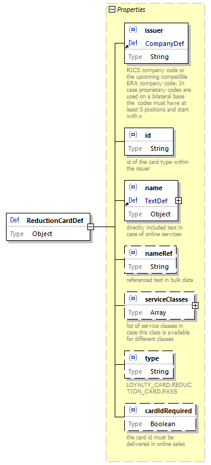

### ReductionConstraint

A fare associated with this constraint requires one of the listed cards to be presented by the passenger on the trip. Card Ids can be taken from the listed cards provided within the fare data delivery or from the common code list in Reduction “cards”.

<!-- Figure 28 ReductionCardConstraint data structure offline -->
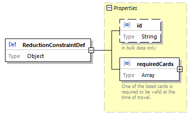

<!-- Figure 29 ReductionCardReference data structure -->

### RegionalConstraint

Definition of a regional validity of a fare. The regional validity constraint is defined by an entry connection point and an exit connection point to combine this regional validity with other regional validities of other carriers and the specification of the regional validity that is sued and described in *IRS 90918-4* for ticket control. The entry or exit connection point might be missing in case the fare cannot be combined or can be combined on one side only.

| Content | Description |
|---|---|
| `entryConnectionPoint` | Defines the connection point for connecting this fare at the start of regional validity (see ConnectionPoint)
| `exitConnectionPoint` | Defines the connection point for connecting this fare at the start of regional validity (see ConnectionPoint)
| `regionalValidity` | Definition of the regional validity as defined in *IRS 90918-4*. It provide data structures for zones, Lines, train links, geographical polygons and routes.

The connection points are included for combining regions. When combining two regional validities from two carriers the connection points will disappear in the combined data structure for bar codes and ticket control and from the textual description for the passenger.

E.g.:

- Carrier 1: RegionalConstraint  {Exit (A,B), RegionalValidity X – Y/Z- A}
- Carrier 2: RegionalConstraint  {Entry (A,B), RegionalValidity B – C/D – E}
- *Result*:  X*Y/Z*A*B*C/D*E

The allocator might need to remove doubled stations in routes in case the connection point is a real station used in both regional validity descriptions in case it is displayed as one combined text:

- Carrier 1: RegionalConstraint  {Exit (A), RegionalValidity X – Y/Z- A}
- Carrier 2: RegionalConstraint  {Entry (A), RegionalValidity A – C/D – E}
- *Result*:  X*Y/Z*A*A*C/D*E --> X*Y/Z*A*C/D*E

#### Connecting Regional Validity to Trips

The regional constraint is connected to the timetable via the regional validity, the connection points are used to combine regional constraints.

To support legacy implementations the connection points can provide a border point code linked with the timetable.

<!-- Figure 30 Connection points and timetable routes -->
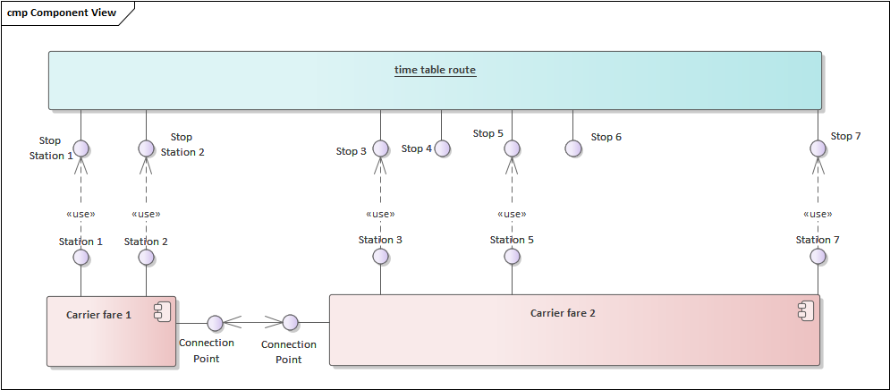

<!-- Figure 31 Regional validity constraint data structure -->

The online data structure will not use the id and will directly include the entry and exit connection point, whereas the offline structure will include the id of the connection point pointing to a connection point within the same data delivery.

The regional validity contains also content that is applicable to synchronous data transfer only (e.g. train links for train bound offers).

The data structure `RegionalValidity` is defined in *IRS 90918-4* and included by reference only. It provides a sequential list of region definitions that can be defined as zones, lines, train links (online version only) geographical areas (polygons) and route descriptions (via-stations). The route description is extended to include fare reference station sets within the route.
  
<!-- Figure 32 regional validity data structure -->
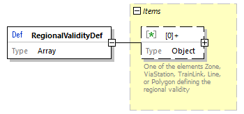

Extended route data structure including fare reference station sets.

<!-- Figure 33 route description (ViaStation) data structure -->

<!-- Figure 34 RegionalConstraint data structure - copy of 90918-4 -->

### ReservationParameter

ReservationParameter provide data on how to combine reservations with NRT fares, how to book reservations via the *IRS 90918-1* interface and which options a passenger has for reservation.

| Code | Description |
| --- | --- |
| `reservationRequired` | A reservation must be made accompanying an NRT ticket. |
| `reservationParameters981-1` | Parameters to request the correct reservation using the interface according to *IRS 90918-1*. |
| `reservationOptions` | Reservation options available that would not change the offer (same price and conditions) (e.g. Aisle or Window). The information is static and does not mean that such an option is still available. The preferences are grouped in case a selection is required (Aisle or Window). |

<!-- Figure 35 ReservationParameter data structure -->
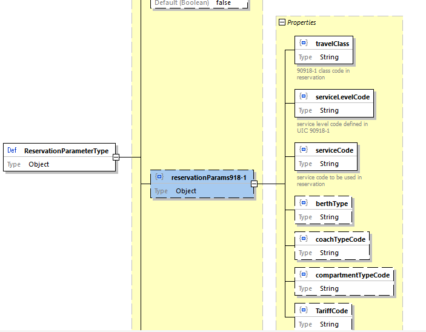

<!-- Figure 36 ReservationParameter - support for 90918-1 reservation interface -->

<!-- Figure 37 ReservationParameter data structure - reservation options -->

Code Lists

- Code list Preference Groups: see Preference groups
- Code list Preferences: see Preferences of places

### StationDetail

Details on stations including codes and names. Codes must include the MERITS code
in case it is defined for a station.

<!-- Figure 38 structure Station detail data -->
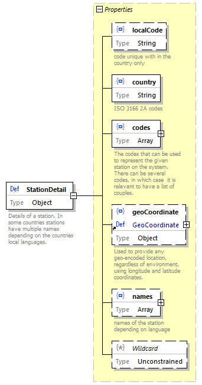

### StationNames

Station names provides multi language names in short and long form as currently no
other data source can provide these names. Short names are used within the route
descriptions whereas the long for is used for entry and exit stations.

A legacy border point code can be provided during the migration to the OSDM data model.

<!-- Figure 39 structure Station detail data (offline only) -->
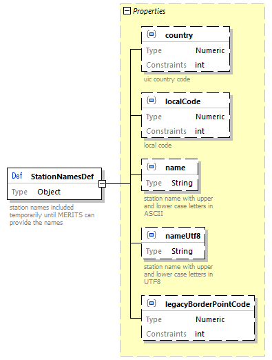

### Text

Used for all textual descriptions where translations might be needed.

<!-- Figure 40 structure Text Data Structure -->
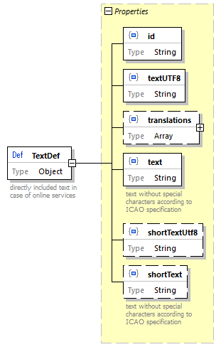

<!-- Figure 41 structure Translation Data Structure -->
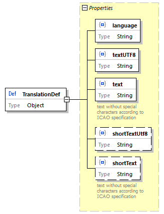

### SalesAvailability

Sales availability defines the constraints on the time when a sale of a fare can
start or end. The sales availability is used in the offline data exchange only. A
constraint is provides as a list of `salesRestrictions` that have to be applied.

Sales restrictions can define a start and end of the sale relative to the date of
sale or the date of travel.

A reference to a calendar can be provided to indicate all sales dates.

<!-- Figure 42 structure Sales Availability -->

<!-- Figure 43 structure Sales Availability -->
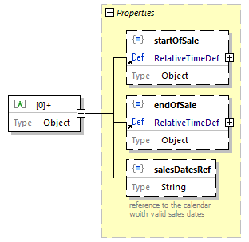

#### Data Constraint on SalesAvailability

| Code | Description |
|---|---|
| `startOfSale`, `endOfSale` | `startOfSale` < `endOfSale`|

### ServiceClass

Service class provides textual descriptions for the predefined service classes.

<!-- Figure 44 structure Service Class -->
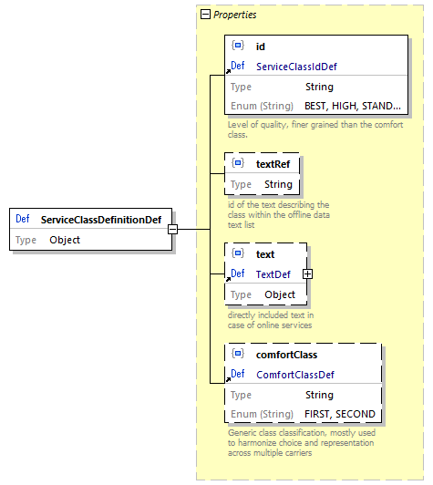

### ServiceConstraint

The service constraint limits a fare to specific service brands (train types). The constraint can either be defined as a list of service brands included or as a list of service brands excluded for the fare.

The online data structure will not provide the id.

<!-- Figure 45 structure Service Constraints -->
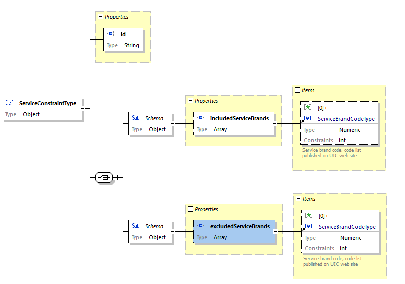

#### Data Constraints on ServiceConstraint

| Code | Description |
|---|---|
| `includedServiceBrands`, `excludedServiceBrands`| Only one of the lists can be used. Using both lists is forbidden. |

### ServiceLevel

The service level data provide additional information (e.g. text) in the offline
data exchange in case the reservation API of *IRS 90918-1* is used.

Description of a service level. The service level defines a specific product on a train
which can have a price (e.g. Double places with shower, …). It is more specific than
just the classic travel class.

The available service levels are defined in *IRS 90918-1* element 308 (Service level code). The data
indicate the service class that needs to be booked in case the reservation is not an IRT and parameters
needed for reservation via the *IRS 90918-1* interface.

Some service levels might require a mandatory reservation.

Additional to a service level there might be reservation options that do not affect the price. There are
listed in reservation options. (e.g. Upper or lower berth in the service level for double Sleeper
compartment).

<!-- Figure 46 Service level description (offline) -->
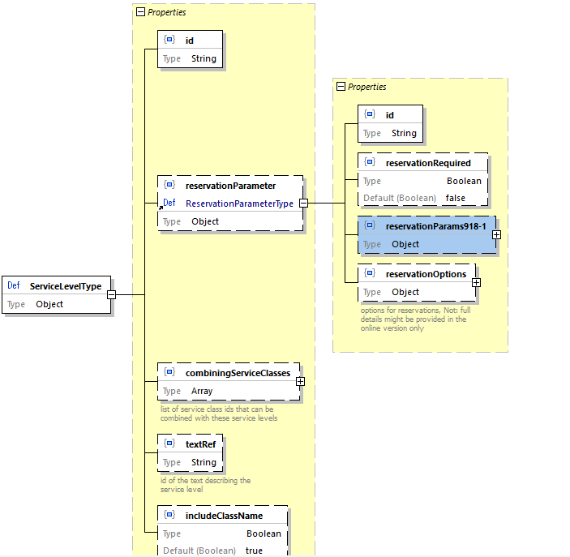

### TravelValidityConstraint

The travel validity constraint defines at which times the passenger is permitted to travel.

#### Data Constraints on TravelValidityConstraint

<!-- Figure 47 travel validity data structure -->
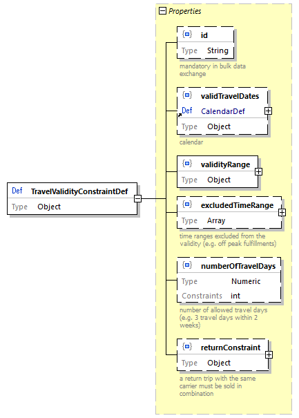

<!-- Figure 48 travel validity data structure – validity range -->
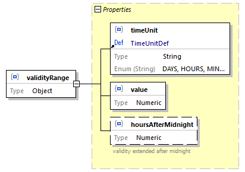

<!-- Figure 49 travel validity data structure – excluded time range -->

<!-- Figure 50 travel validity data structure - return constraint -->

| Code | Description |
|---|---|
| `excludedTimeRange` | `from` time < `until` time
| `numberOfTravelDays` | A duration must be provided
| `returnConstraint` | `earliestReturn` < `latestReturn`

### ZoneDefinition

Definition of zones used in regional validity.

The area of a zone can be defined by either a list of stations, geographical polygon of a list of NUTS
codes. Multiple definitions are allowed in case they define the same area.

<!-- Figure 51 zone definition -->

