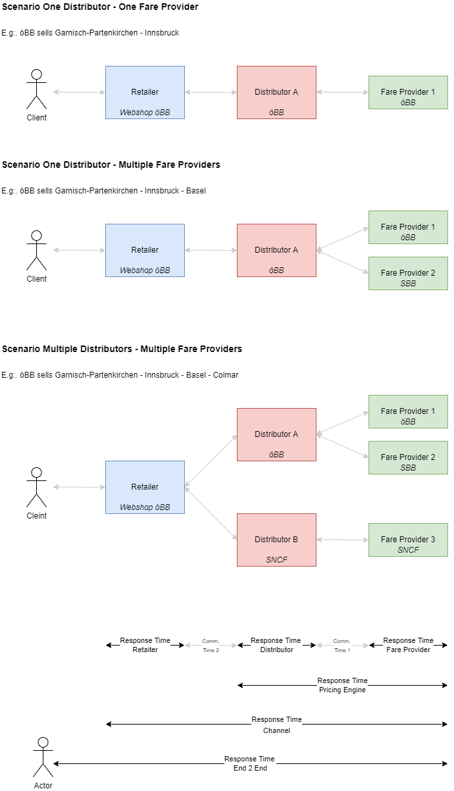

## Best Practices for Non-Functional Requirements

From a customer point of view, to book a trip he or she expects a seamless and fluid user experience.
Fundamental to achieving this goal are fast responses for all requests triggered by the customer.

From a business point of view, the [response time of a site directly correlates with the conversion rate](https://www.thinkwithgoogle.com/marketing-strategies/app-and-mobile/mobile-page-speed-conversion-data/). This means if a
site takes too long to load, the customer will leave the site with out actually buying a ticket.

In order to achieve a seamless and swift user experience, all parties involved most play their part and
provide fast adn predictable response times. Formally, by `95% Response Time` we denote the response
time for 95% of all request. By `Max Response Time` we denote the maximum time a response can take before
a time out must be expected.

For achieve a good customer experience, we need to define some response time for a each parties and we
assume the fare providers and pricing engines can be called in parallel.

*ToDo*: Clarify Naming

| Response time | Description |
|---------------|-------------|
| Fare Provider Response Time  | Time to calculate/fares
| Allocator Response Time      | Time to calculate an offer from (remote) fare provider(s) |
| Distributor Response Time    | Time to combine offers from  |
| Pricing Engine Response Time | `Allocator Response Time + max(Fare Provider Response Times 1..m) + Communication Time 1` |
| Channel Response Time        | `Distributor Response Time + max(Pricing Engine Response Time 1..n) + Communication Time 2` |

The following illustration highlights the different response times:

To achieve a good user experience with fast response time the following the three response
times are crucial.

1. The longest response of any fare provider involved.
2. The longest response of any pricing engine involved.
3. The time it takes the distributor to render the content.

This observation leeds to the following non-functional requirements for a given role.

### Non-Functional Requirements for a "Channel"

Mandatory service level requirements to be fulfilled by a channel.

The Look-2-Book rate relates to the number of bookings created by the type of offer request.
The expected response time in milliseconds that a service must provide includes the
infrastructure of the provider of the server (firewalls, load balancer, circuit breaker and
application) but not the network in-between the sender and receiver.

| Resources | Look to Book Rate | 95% Response Times (msec) | Max. Response Time (msec) | Required Error Handling |
|-----------|----|----|----|----|
|`/places` | - | 60 | 80 |  |
|`/trips` | - | 400 | 600 |  |
|`/trip-offers-collection` | 1000:1 | 1000 | 2000 | |
|`/offers` | 100:1 | 1000 | 2000 | |
|`/offers/{offerId}/...` | 5:1 | 800 | 1600 | |
|`/bookings` | 1:1 | 400 | 600 | Retry of the booking request followed by a `DELETE /booking/{bookingId}` in case the booking is not needed any more. The error handling must be repeated for three days but no further than the train departure or until an appropriate reply was received indicating that the booking was not made.|
|`/bookings/{id}/passengers` | 0.01:1 | 600 | 900 | retry |
|`/bookings/{id}/fulfillments` | 1:1 | 600 | 1200 | |
|`/fulfillments`| 1.1:1 | 600 | 1000 | |
|`/bookings/{id}/refundOffers` | 0,5:1 | 1000 | 2000 | |
|`/bookings/{id}/exchangeOffers` | 0.01:1 | 1000 | 2000 | |

### Non-Functional Requirements for the role "Fare Provider"

Mandatory service level requirements to be fulfilled by a fare provider / carrier.

The Look-2-Book rate relates to the number of bookings created by the type of offer request.
The expected response time in milliseconds that a service must provide includes the
infrastructure of the provider of the server (firewalls, load balancer, circuit breaker and
application) but not the network in-between the sender and receiver.

| Resources | Look to Book Rate | 95% Response Times (msec) | Max. Response Time (msec) | Required Error Handling |
|-----------|----|----|----|----|
|`/places` | - | 50 | 75 | |
|`/trip-offers-collection` | 1000:1 | 400 | | |
|`/offers` | 100:1 | 400 | | |
|`/offers/{offerId}/...` | 5:1 | 400 | | |
|`/offers/{offerId}/fares/{fareId}` | 5:1 | 300 | | |
|`/bookings` | 1:1 | 200  | | Retry of the booking request followed by a `DELETE /booking/{bookingId}` in case the booking is not needed any more. The error handling must be repeated for three days but no further than the train departure or until an appropriate reply was received indicating that the booking was not made.|
|`/bookings/{id}/passengers` | 0.01:1 | 200 | | retry|
|`/bookings/{id}/fulfillments` | 1:1 | 200 | | |
|`/fulfillments`| 1.1:1 | 400 | | |
|`/bookings/{id}/refundOffers` | 0.5:1 | 400 | 800 | |
|`/bookings/{id}/exchangeOffers` | 0.01:1 | 400 | 800 | |
|`/coachLayouts` | Once per day | 8000 | 10000 | |
|`/coachLayouts/{layoutId}` | 2:1 | 200 | 300 | |
