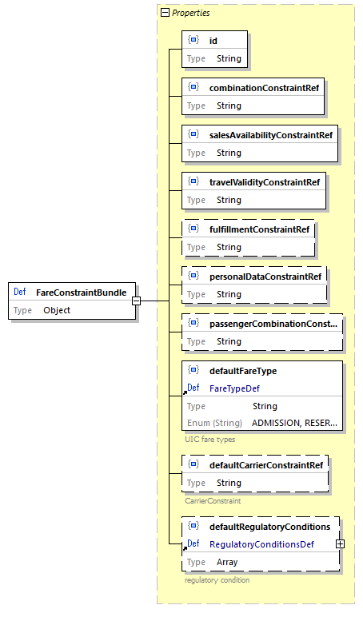
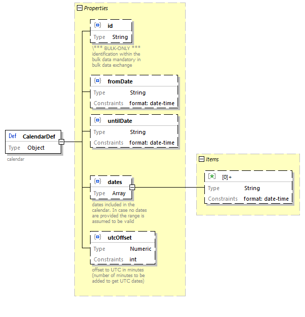
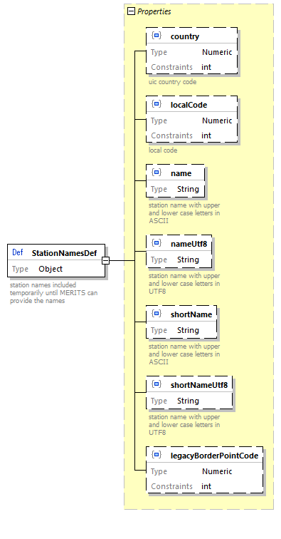
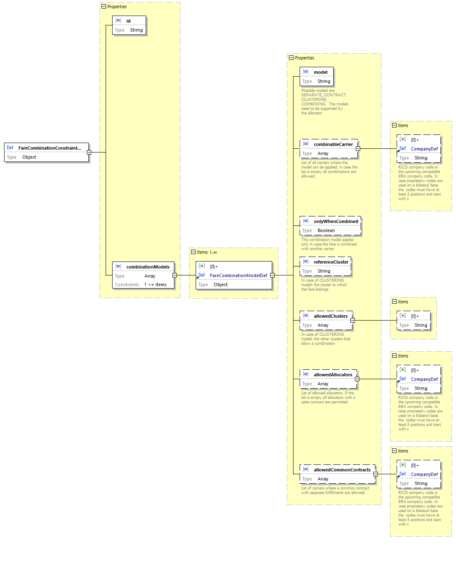
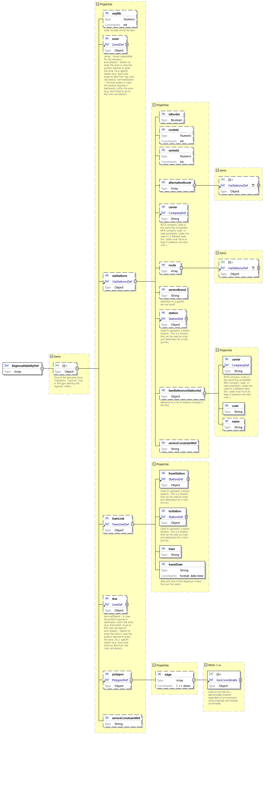
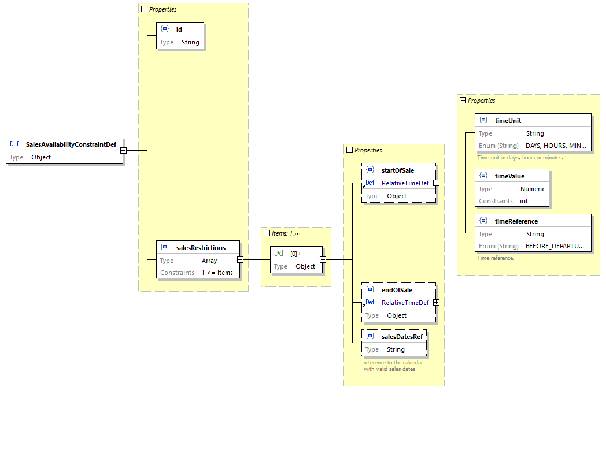

## General Scenarios

Within the offline sales model the participating companies agreed to allow sales based on the provided fare data. The receiving company is responsible to apply the rules defined within the fare data. In case the implementation does not cover some features it is not allowed to sell fares that use these features.

## Fare Exchange

Fares can be exchanged by bilateral file exchange, via a queue provided according to this specification or via some common exchange platform like the upcoming OSDM data exchange platform in case the company is a member of the platform.

Exchanged fare data deliveries can be defined to be implemented mandatory or to be optional thus allowing to continue the sales with the previous version. In case a mandatory version replaces a previous version it also replaces all previous optional version with-in the chain.

A data delivery might specify a minimal version number of the schema that needs to be supported to use the data.

## Versioning of Data Delivery Schemas

The data delivery will contain the version number of the used json schema and the version number which is required to process the data. Also, a change in a minor version might restrict the usage of older version in case a carrier used a new optional feature which is mandatory to his fares.

## Versioning of Data Delivery Data

The data delivery has a unique id. It can indicate that it replaces a previous delivery 
by indicating the data delivery id of the delivery to be replaced. Deliveries can be 
marked as optional. In this case a user of the data delivery might ignore the delivery. 
Deliveries marked as mandatory have to be used.

## Automated Bulk Data Exchange

Automated asynchronous bulk data transfer is an option implemented by queues. The queues must implement the [AMQP 1.0 specification](https://www.amqp.org/about/what).

On bilateral agreement other queue technologies might be used between two systems.

Queue authentication and encryption must use TLS version 1.2.

### AMPQ Header Parameter

| Parameter | Usage |
|---|---|
| `message-id` |Technical id of the data transfer, not the data delivery id in the data.
| `user-id` |  |
| `to` | |
| `subject` | „fare-data-delivery_“\<version\>
| `reply-to` | N/A
| `correlation-id` | N/A
| `content-type` | `application/json`
| `absolute-expiry-time` | 1 year ahead
| `creation-time` | Time stamp when the data are put to the queue
| `group-id` |
| `group-sequence` | 
| `reply-to-group-id` | |

## Asynchronous Fare Data Delivery

The fare structure delivery is the bulk data object collecting the fare data `fareStructure` of a delivery and the delivery meta data `delivery`.

### Definition of a single fare

The single fare represents the smallest unit to be integrated in an offer. Within the 
offline data the fare collects the references to the constraints that need to be applied 
and the price.

Some constraints are bundled within the fare constraint bundle to avoid repeating the 
same data too many times:

## Basic definitions included in the data delivery

Basic definitions are provided within each data delivery. The basic definitions are 
included only once and are references within the data via their id.

### Calendar

### Text

### Station names

### Reduction cards

### Connection points

### fare reference station set

### Price

## Definitions of a different fare constraints

### fare after sales constraint

### fare carrier constraint

### fare combination constraint

Constraints ruling the possible combinations with other fares of other providers.

### fare passenger combination constraint

Constraints ruling the possible combinations of passengers for combination on a ticket.

### fare personal data constraint

Definition of the personal data required e.g. in a bar code of via online ticket control.

### fare reduction constraint

### fare regional constraint

### fare sales availability constraint

### fare service constraint

### fare travel validity constraint

 
## Data supporting online services

### fare resource locations

Information on where to fine resources for online services of OSDM online or via 90918-1 APIs

### fare reservation parameters

Data to define reservation requirements related to a fare.

