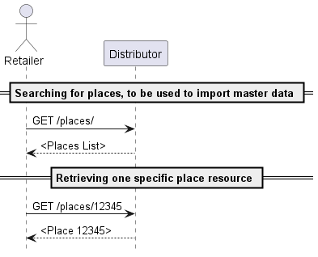
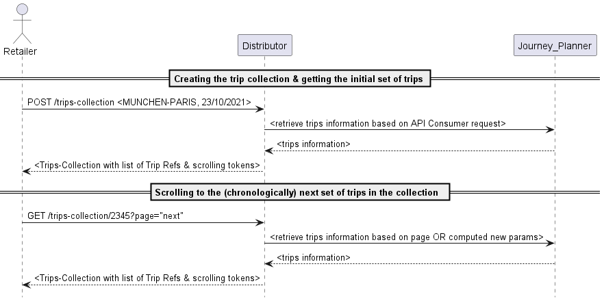
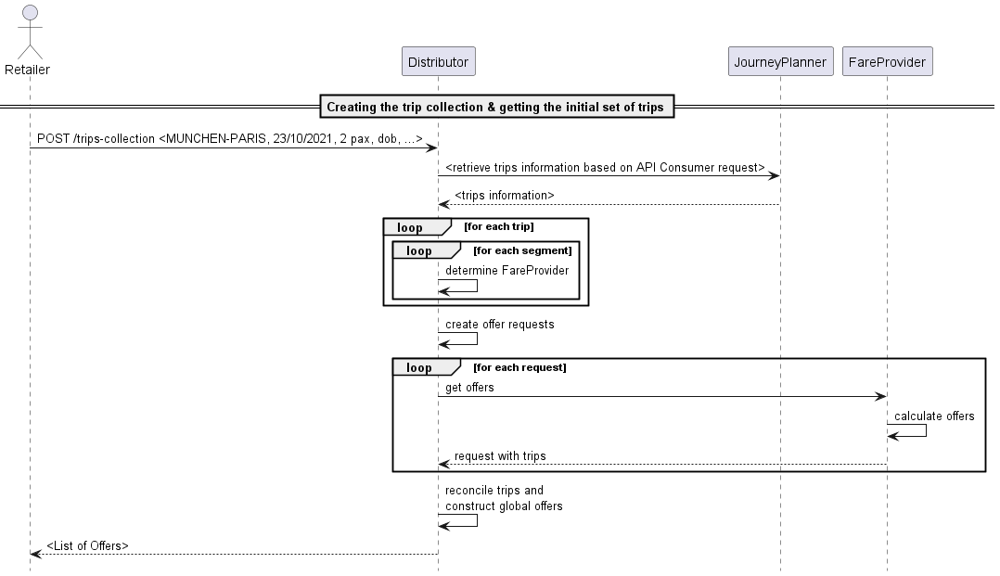
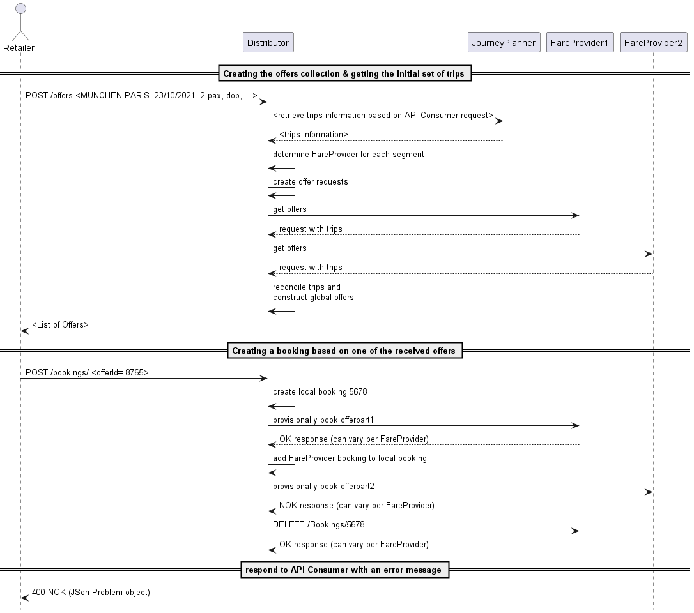
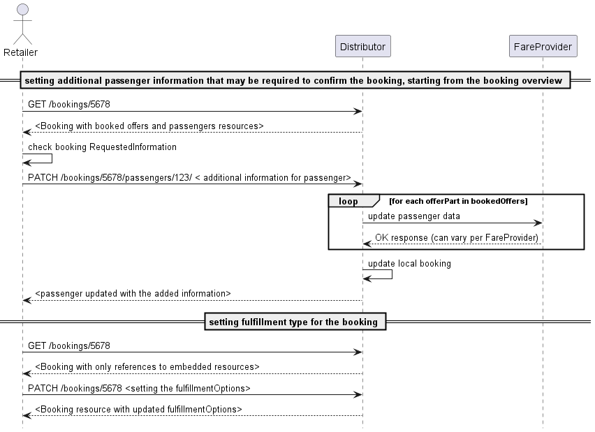
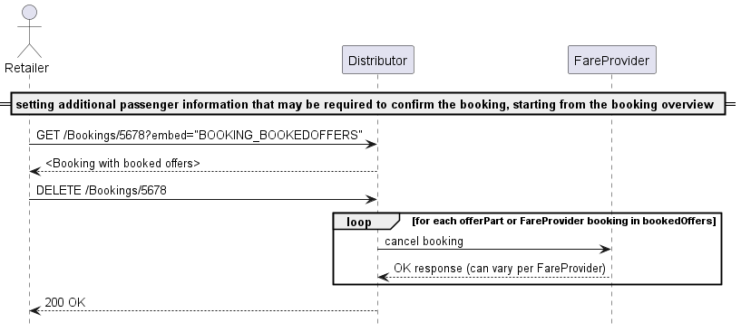
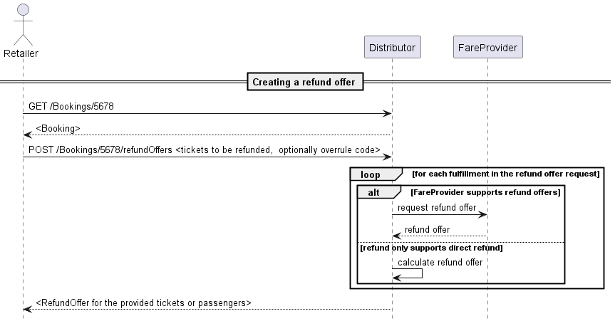
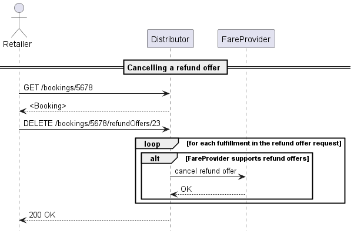
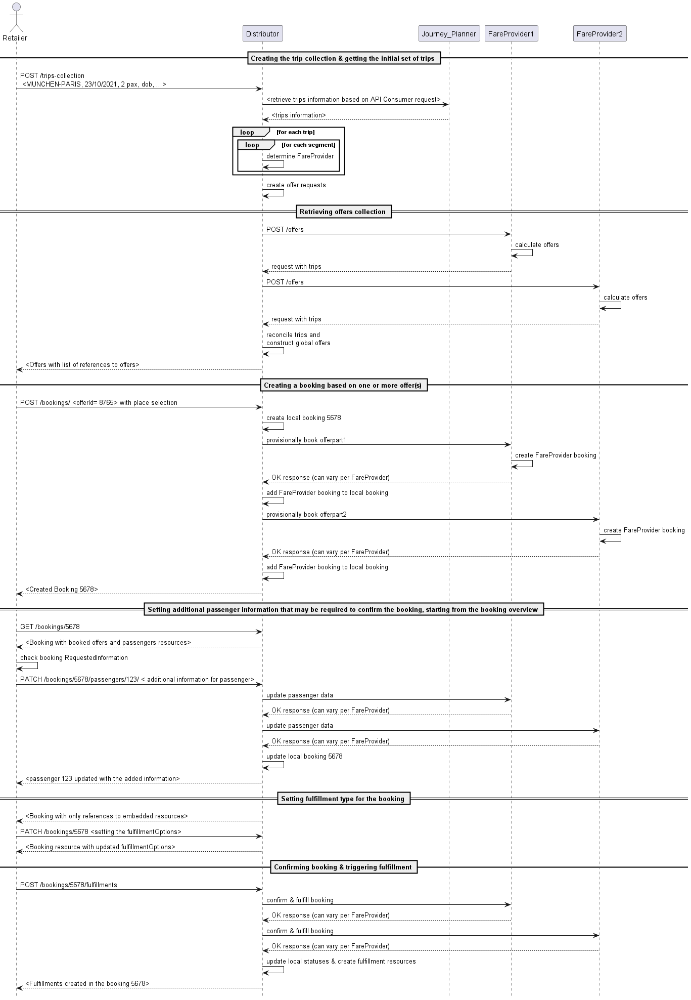

## Introduction

This page shows a representation of the data models underlying the API
specifications. It is therefore not a strict representation of the resources
themselves (those are self-represented in the OpenAPI specifications.)

The main purpose of this document is therefore to help a quicker
understanding of the API and its underlying concepts. As such, some of
the details of how the information is structured in the API
are not represented or simplified in the data models.

## Overview of Services

|Resources | Description |
| --- | --- |
| `/places` | Resources to search for places |
| `/trips` | Resources to search for trips|
| `/trip-offers-collection` | Resources to get bookable offers|
| `/trip-offers/{tripOfferId}` | *dito*|
| `/offers/{offerId}` | *dito*|
| `/offer-collections` | Resources to get offers for non-journey based products|
| `/bookings` | Resources to manipulate bookings|
| `/offers/{id}/passengers` | Resources to manipulate a passenger's information at every stage of the flow|
| `/bookings/{bookingId}/passengers/{passengerId}` | *dito*|
| `/bookings/{bookingId}/reservations/{reservationId}` | resource to retrieve availability information on places (seats,..)|
| `/products` | Resources to retrieve products information on one or more products|
| `/bookings/{bookingId}/fulfillments`| Resources to retrieve fulfillments, e.g. tickets|
| `/fulfillments` | *dito*|
| `/bookings/{bookingId}/refundOffers` | Resources to get and accept a refund offer|
| `/bookings/{bookingId}/refundOffers/{refundOfferId}` | *dito*|
| `/bookings/{bookingId}/exchangeOperations/{exchangerOperationId}` | Resources to get and accept a exchange offer|
| `/bookings/{bookingId}/exchange-trip-offers-collection` | *dito*|
| `/bookings/{bookingId}/exchange-trip-offers` | *dito*|
| `/coachLayouts` | Returns all coach layouts.|
| `/coachLayouts/{layoutId}` | Returns a coach layout for layout id|
| `/complaints` | resources to create and manipulate complaints|
| `/masterdata/reductioncards` | retrieve reduction card types|

## Process Flow

The process flow starts with getting offers which can be chosen by the customer. Once
selected they can be pre-booked and after the payment process (which is outside of the
scope of this document) they can be booked. The fulfillment of the booking can either
be on paper or paperless.

If needed bookings can either be refunded or exchanged by providing the customer with
a refund or exchange offer which can then be booked by the customer.

## Trips and Places Processes

### Looking Up Places

The `\places` Lookup can be used by an API provider in order to search for places.
Two typical uses cases would be

- getting a set of places (in full or as reference) from a substring of the name
- getting full details on a location based on one of its codes

Note that the functionality is not intended to trigger a "dump" of the complete places
list or to build a full "browsing" functionality, hence the lack of pagination features here.

Given the high stability of this information, places are given a long time to live
and get responses can be cached for a long period, so these operations should not be too
costly in terms of calls or bandwidth.

#### Error handling

Error handling by the **Distributor** remains basic here as a handful of cases have to
be handled:

- invalid characters in the search string
- no result found for the given criteria.
- The search did not return any result
- unknown error on server side

In all cases, the error handling starts and stops with the **Distributor**
returning the appropriate JSON Problem element.

In case the error can apply to multiple fields, it is recommended to provide
additional details such as the incriminated field in the detail property of
the `Problem` element.

### Getting and Browsing Trips

If the API consumer only needs a schedule, and no bookable offer, it has the
possibility to create a trips collection using `POST /trip-collection`. If the
query is successful, the initial response to this will be a set of trips
matching the provided search criteria.

Please refer to the Yaml specifications for the list of search criteria
available. Depending on their respective journey planner capabilities, it could
be that some criteria cannot be supported by one or the other OSDM:Distributor
In this case it is up to the implementing party to clearly document those
limitations together with the publishing of its OSDM endpoints. In all cases,
at least `origin`, `destination` and `travelDateTime` must be supported

Based on an initially returned trips collection, it is then possible to
retrieve  earlier or later trips using `GET the trip-collection` by specifying
the appropriate scrolling-tokens. As with all cases where nested resources can
be returned, individually or in list, the embed feature allows specifying
whether complete trips should be returned or only a title and a link. A GET
verb without any scrolling-token will simply return the last set of trips
return.

It is important to ensure that once a trip has been generated, its id can
be re-used in possible subsequent operations within a reasonable time-frame:

- When scrolling back and forth over time, a same trip should maintain the
  same id, so the API consumer can, if desired, expand the set of trips in its
  own context and have the guarantee that one same trip (in terms of content)
  will remain with the same id (in terms of resource id).
- It could be used in a subsequent offer request, so that offers are now built
  for that specific trip

#### Error Handling

Since requesting trips still does not involve any transactional operation, the
error handling is also limited to returning a JSON problem element. The
following cases are to be considered:

- A search criteria value contains invalid value or invalid characters
- A search criteria lies outside accepted boundaries: it could be the date in
  the past, or too far in the future, or value outside bounds for the max
number of changes
- The origin or destination is not known
- The search did not return any result
- Unknown error on server side

In case the error can apply to multiple fields, it is recommended to provide
additional details such as the incriminated field in the detail property of the
`Problem` element.

## Offers

### Getting and Browsing Offers

Requesting and browsing offers works a lot like the trips: the API consumer
submits search criteria, and a collection of "trip offers" is returned. This
collection can be browsed to earlier and later trips the same way as the trips
collections.

The search criteria for offers extend the search criteria available for trips
with additional criteria applicable to the fares and products that can be
returned such as the fare flexibility, the service class or the currency the
offers should be proposed in.

Although the trip-related search criteria are present and will likely be the
easiest and most used option, there is an alternative way to search offers if a
set of specific trips is already known: provide the complete trip structure for
one or several trips. It is actually the only way to go for a request to a fare
provider working according to nTM rules. In this case, the trips provided may
be larger than the part for which fares are requested. For this reason, the
requested section must then be provided so that the provider knows which
portion to work on. When this method is used, the API consumer can provide a "tripkey" together with the trip specification, which will be echoed in the tripoffer element matching that specific trip, for an explicit reconciliation between requested trips and provided offers.

An offer request to an **Allocator**, **provider** or **fare provider** can lead to
offers with multiple `OfferParts`, potentially coming from different sub-providers
(OSDM compliant or not). However, in preparing offers with multiple offer parts
for the API consumer, the **Distributors** must follow the following rules:

- The POST `/trip-offers-collection` only generates complete offers covering the
  complete trip (or complete section) requested.
- While the combination logic is left to the **Distributor**, it is recommended to
  only build and retain offers that are *homogeneous* (as much as possible) in
  terms of flexibility and comfort.
- As with the trips, it must remain possible to scroll forward or backwards over
  tripOffers based on their id and the scrollToken.

As described further on, any additional information required for
the provisional booking can be provided in the booking operation itself

The resources used at offer steps optionally offer various *levels of embedding*
(returning complete structure is the only mechanism made mandatory by
the working group at the moment) and multiple granularity for the retrieval of
information, so each implementing party can fine-tune the queries in order to get
all the information needed for the processing at hand, and only that information.

#### Offer Messages

During the offer construction, the **Allocator** or **provider** can encounter events
that, while not halting the process or constituting an error, may be relevant
for handling of the response by the API consumer. These events can then be
passed on using the offer `Message` element. The following events are identified
and relevant to this section

- Overbooking
- Schedule correction applied

### Round trip handling

We define a round trip as a mirrored couple of trips *(A-B B-A)*, each made of
one or more segments.

The construction of a round trip in OSDM is always a two-step process, where the
outward offers are requested separately from the inward offers.

#### Receiving offers with return products and fares

In order to indicate to the provider that the intention is to build a return trip,
the `returnSearchParameters` are used:

When requesting offers for the outward travel, the API consumer has to
provide a return date. The response will contain a set of offers. Each of these
offers will have a `offerTag`. Usage of it is described further below.

To get offer for the inward travel, the API consumer will have to provide:

- The id of the outward `tripCollectionID` (allows knowing the context in which
  the outward offers are made)

- Depending on the targeted fare provider, the `offerTag` for the selected
  outward offer, or the set of potential offers (as the `offerTag` does not
  have to be unique. E.g. all offers for a given date might have the same
  if the constraint is only on date) can or must be provided.
  Whether the `offerTag` is mandatory in the inward offer request is indicated by
  the "mandatory flag" that is provided in the outward offer response next to each
  offerTag. If the `offerTag` is provided in the inward offer request, the
  provider should then only return offers that are compatible with the indicated
  (set of) outward offers.  
  Note that depending on whether the `offerTag` is mandatory or not and whether it
  is unique per outward offer, it may or may not be mandatory to select the outward
  offer before the inward offer request can be constructed.

#### Using returnTags

Besides the `offerTag` discussed above, some offers may have one or more
`returnTag(s)` as well. As the name suggests, these can be used in order to
determine how to combine offers in a return trip.

The idea is actually fairly simple: in case no filtering is applied on the
inward offers using the `offerTag` filter mentioned above, the returned inward
offers may not all be compatible with all outward offers.
Compatible pairs are simply identified by the fact that they have the same (set
of) `returnTag(s)`. Offers with no return `returnTag` have
no constraints.

Hereunder an example illustrating this concept:

##### Outward Offers

- Offer1: -
- Offer2: #123
- Offer3: #234, #123
- Offer4: -

##### Inward Offers

- Offer5: -
- Offer6: #123
- Offer7: #345
- Offer8: #123, #234

##### Valid Combinations

- Offer1 + Offer5 (no constraint on Tags)
- Offer4 + Offer5
- Offer2 + Offer6
- Offer3 + Offer8

Offer7 cannot be combined with any offer on the outward set.

#### Products Covering Both Directions

While in most cases the two trips are materialized with distinct products/fares
for the fare provider, there are fare providers still proposing unique
products covering the outward as well as the return. In this case, the product
element can be flagged as covering the mirrored segment as well. As for the
offer construction process, the provider will simulate the two steps approach by
using one of the following approach:

- The same product covering both outward and return is proposed in the offers
  for the two directions

- For one of the two directions, a dummy product is returned.

Regarding the price, it can either be placed in full on the offers in the two
directions (but then the total price will be incorrect when looking at the
complete return travel), or split in any way desired between the outward and
the return.

#### Error Handling

- the referenced trip cannot be found
- A search criteria value contains invalid value or invalid characters
- A search criteria lies outside accepted boundaries: it could be the date in
  the past, or too far in the future, or value outside bounds for the max
number of changes
- The origin or destination is not known
- The trip search did not return any result
- No offer could be built for any of the discovered trips
- Schedule mismatch between systems
- Unknown error on server side

#### Getting Coach Layouts

Graphical seat reservation allows a customer to conveniently choose its
preferred place. Therefore two resources are added: First, `GET /coachLayouts`
to import all coach-layouts of an allocator. This service can be used periodically
as master data service . Second, `GET /coachLayouts/{layoutId}` returns the
information for a given `layoutId` and can be used during the on-line offering
and booking process.

## A Complex Example Mixing Offers and Fares

### Request From Front-end

I want to go from Rotterdam to Wien Stephansplatz via Antwerp.

### Request Submitted to SNCB

Proposed trip by timetable system:

| Origin - Destination| Train Number |
| --- | --- |
| Rotterdam → Antwerp | Thalys 9324 (mandatory reservation) |
| Antwerp → Liège | IC 2345 + IR 5567 |
| Liège → Frankfurt | ICE 122 (mandatory reservation) |
| Frankfurt → Wien Hbf | RailJet RJ 23 (optional reservation) |
| Wien Hbf → Wien Stephansplatz | Metro |

### Fare Provider Resolution returns

| Origin - Destination | Train Number | Fare Provider | Consolidated |
| --- | --- | --- | --- |
| Rotterdam → Antwerp | Thalys 9324 (mandatory reservation) | PAO | PAO |
| Antwerp → Liège | IC 2345 + IR 5567 | Fare SNCB | Fare SNCB |
| Liège → Frankfurt | ICE 122 (mandatory reservation)|  GUS | GUS
| Frankfurt → Wien Hbf | RailJet RJ 23 (optional reservation) | Frankfurt → Salzburg (Border) | Fare DB |
| | | Salzburg (Border) → WienHbf | Fare ÖBB| |
| | | Frankfurt → Wien Hbf (reservation) | Fare ÖBB |
| Wien Hbf → Wien Stephansplatz|  Metro | Fare ÖBB |

## Booking Processes

### Creating a Booking Based on Offers

Once the offer has been selected, the API consumer can proceed to the booking of that offer.
Along with the offer, optional or mandatory reservations, or ancillaries could be
booked as well. those optional offer parts can be identified easily in the
offers as they will always be linked with an admission product (in
admission.reservations or admission.ancillaries). The link contains the
relationType property, which indicates whether the pointed reservation is
included (in which case it is not needed to explicitly add it in the booking
request) , mandatory (the reservation must be added in the booking request) or
optional (the reservation can be added in the booking request. Ancillaries are
never mandatory (only included or optional). Adding optional or mandatory
elements is simply done by adding the respective offer part in the booking
request (cf YAML specifications) `POST /bookings`.

It is also possible to book several offers in one operation to the same
booking. This is especially relevant to support return trips, where in most
times it will be mandatory. If this is the case, a collection of offer ids (and
associated reservations and ancillaries) is given instead of just one. However,
note that in this case the passengers party for all booked offers needs to be
the same. To ensure this, the passenger reference of each member of the
passenger party must remain the same from one offer to the other.

If the booking succeeds, a new booking resource is created. In this booking,
the booked offers can be found and should look a lot like the offers as they
were in the offer responses, with the exception that for reservations and fares, 
the reservedPlaces element will now be populated
with the places that have actually be assigned to the passengers for
this offer part.

### Additional availability information before provisional booking step

In most cases the offer will not contain information on specific place properties for 
reservations. the reservation resource in the offer provides information on the availability of 
places with the selected offer:

 - Places with specific properties
 - Places nearby another place
 - A graphical display of available places.

### Additional information in provisional booking step

In some cases, additional information must be provided before or at the provisional booking time
in order to be taken into account, such as:

- Additional passenger identity information
- Additional accommodation preferences regarding the accommodation, or its exact location.

While providing accommodation preferences is often optional, some information (usually on passengers) may be mandatory in order to proceed
with the booking. The `RequestedInformation` property will provide the details of
what needs to be specified in order to book a given offer. These details are
provided under the form of a boolean expression, referring to the passenger
model elements using dot notation (with the `TripOffer` as the root). For
example, if it is required that name and first name are set to proceed
`RequestedInformation` would be :

`passenger[<uuid>].details.firstName AND passenger[<uuid>].details.name`

Another example, if on top of first and last names, at least one email or one
phone number is needed:

`(passenger[0].details.firstName AND passenger[0].details.name AND
(passenger[0].details.eMail OR passenger[0].details.phone))`

By parsing this structure, the API consumer is able to identify the elements
that need to be filled-in to proceed. An initial version the [grammar for required
information](../requested-information-grammar.html) is available for review.

The two types of information (accommodation preferences and passenger data updates)
are both to be added in the POST /booking body:

- passenger information can be specified in the passengers array: `bookingRequest.selectedOffers[].passengers`
- seating preferences can be provided in `bookingRequest.selectedOffers[].placeSelections`

#### Reusable offers

A reusable offer is an offer that can be booked several times, as long as there is sufficient availability, in distinct bookings and
for different, but equivalent, sets of passengers from those of the initial offer request.

The new set is considered equivalent when composed of passengers with a similar profile (same reductions and birth date entitling to the same product(s)).

In case of:

- booking a reusable offer for a new set of passengers, all passengers' attributes need to be be fully specified in
  the `POST /booking` body, except the `id` that is always generated by the server.
- booking an offer, reusable or not, for the same set of passengers of the offer request,  all properties are updatable except:
  - `id`
  - `externalReference`

Note however that updating a property can influence the eligible product in the offer (such as date of
birth or reduction cards) may lead to the booking being rejected in case of incoherence.

It is the choice of the OSDM provider to declare offers as reusable, or not, in the reply to `POST /trip-offers-collection`.
Reusable offers however should be favored whenever possible: while the OSDM provider retains control, it allows implementation
of powerful business use-cases (e.g. a ticket machine at the station that could continue selling reusable offers while
experiencing network issues and would then synchronize the sales upon connection re-establishement).

Reminder: the accommodation preferences can be found in the `reservationOptions`
elements `(offer.fare|integratedReservation|reservation.placeSelection.reservationOptions)`

The passengers in the booking resources are also the same type of resources as
the ones present in offers. However, they could be different resources,
with different ids (the passengers references do remain unchanged).

Initially, a booking will have the status `PREBOOKED` (see also the booking
status model).

#### Error Handling

- The requested reservation option is not available on this transport
- An invalid value is provided for a passenger property
- Referenced offer or offer part not found (offer expired ?)
- No rights to access referenced offer
- Incompatible offer part with the offer
- Missing information
- Reservation to sub-system failed for one or more offer parts
- Insufficient availability for one of the requested products
- Requested place not available

#### Provisionally Booking a Return Trip

While this may not be true for all providers, most of them require that the
outward and the return parts of a return trips are booked together in order
to actually book a return-specific product. Therefore, when building a return
travel, the API consumer should always specify the outward offer(s) and return
offer(s) in the same `POST /bookings` operation.

#### Provisionally booking a trip with offers clusters

When booking for a trip for which several offer clusters were provided
([see offer clusters](../models#offers-with-partial-coverage))), the API
consumer must be careful to always select one and only one offer from each
offer cluster in the tripOffer. This ensures that even though the selection
is done per offer cluster, the complete trip is covered exactly without any
gap nor overlap. However, the provider implementers must verify and validate the
set of offers selected is valid. if the trip being booked is also a return
trip, then the rule applies for each direction.

### Handling Partial Success of Pre-Booking

As a **Distributor**, partial pre-booking is not expected. As a consequence
all pre-booking operations are either fully successful or not executed at all.
However, as an allocator, An **Distributor** system may be configured in such
ways that it is able to combine offers from different sub-providers (via an
OSDM-compliant API or not) and propose them in turn as one offer to its API
consumers, as one undividable product or as a bundled pack.

Unfortunately, when the booking is attempted, the process may encounter errors
leading to the booking failing with some of the sub-providers, while it will
have succeeded for other parts of the offer, directed to other sub-providers.
The result is a partially pre-booked booking. Since this situation is not
compliant with the OSDM specifications, this situation needs to be rolled back.
This can be done by cancelling the pre-bookings that were successful (on an
OSDM sub-provider, it would be performed using the `DELETE /booking/id` verb). An
appropriate error message is then returned in the booking response, under the
form of a JSON problem element.

As it was the case with offers, during the booking process, some events may
occur that are worth communicating to the API consumer, while they do not
really constitute an error nor should interrupt the booking process. These
events and situations can be communicated through the `Warning` messages:

- Price change: the booking succeeded, but the price of the offer has been
  modified between the offer generation and its actual booking
- Overbooking

#### Notes

- Booking an offer will not book the reservations in the offer unless they
  have an "included" relationship with an admission of that offer. In order to
add a non-included reservation to a booking, the reservation ids will have to
be passed additionally or it will not be booked.
- It is up to the OSDM API implementing party to decide whether booked offers
  can have the same resource ids as the offers in the shopping stage. However,
it is assumed in the specifications that this is not the case, and the API
Consumer should not rely on this possibility.
- In case the passengers details are different in the different offers added
  together in a booking, the passenger information of the first offer will be
copied in the booking, and those of the following offers will be ignored.

### Completing Booking for Confirmation and Fulfillment

When the booking has been successfully created, some additional changes may be
desired or even required before the booking can be confirmed.

- As with offers, some passenger information may be required. If this is the
case, the mechanism used is exactly the same as for offers: the
`requestedInformation` property at booking level will indicate which information
is needed to confirm using boolean expressions and dot notation. Updating the
values is done via  a PATCH on passenger sub-resources of the booking (as for
the offer). Even if all the required data is already present, it could still be
relevant to update these values. For example a dummy date of birth might, due
to the selected fulfillment type now be requested to be the exact date and
require an update, even though the property is already filled-in.

- It may be needed or desired to change or set fulfillment type and options. It is
however recommended to the **Distributor** implementers to set a default value
for these properties (especially if only one value is possible). Note that the
choice of the fulfillment type & options may impact the requestedInformation.
This property should therefore be re-evaluated whenever the fulfillment type is
modified (both on the provider and on the consumer side).

#### Notes

The modifications on the passenger's properties will never
impact the products in the offer (thus also not the price), even if this leads
to an inconsistency between the offered product and the updated passenger
property.

#### Error handling

- An invalid value is provided for a passenger property
- Attempted to modify a read-only property
- The booking is confirmed/refunded/cancelled and does not allow modifications

### Cancel a Not Confirmed Booking

In case a pre-booked booking is abandoned by its user, and this event is
captured, it is recommended for the API consumer to properly cancel the booking
on the **Distributor** side. In case this is not done the booking will be
cancelled when the ticket time limit is reached, but in the meantime all
related resources (seats etc) will remain unavailable for other requests. Upon
receiving a `DELETE /bookings` for a given booking, the **Distributor** should
obviously do its own cleaning as well, and if needed pass on the cancel to its
sub-providers.

In case of a partial success for booking, the `DELETE /bookings` can also be used to
clean-up the bookings on sub-providers where the pre-booking succeeded and who
support the OSDM protocol.

Regardless of whether the cancel occurred through an explicit `DELETE /bookings`
or expiry of the ticket-time-limit, the booking state will then change to `CANCELLED`
for a short "grace" period, before being completely cleaned-up (offer parts are
well cleaned-up immediately). This grace period aims at ensuring that any
ongoing operation with the booking is given sufficient time to get an explicit
info on the cancelled status of the booking. The choice of the duration of that
grace period is left to the implementor.

#### Error handling

- the booking is already confirmed
- the booking is already cancelled
- unknown error on the server side

## Confirmation and Fulfillment Processes

### Fulfillment Process

The fulfillment is the final step of the booking. In most cases, the booking
will be confirmed and fulfilled in one step from the API consumer standpoint:

- fulfillments elements are created with the appropriate status (see below)
- the provisional balance becomes confirmed
- the status of the booking changes to `FULFILLED` (for most systems) or
  `CONFIRMED` (see below)
- if relevant the documents elements in the fulfillment resources are created
  and linked

However, in case the **Distributor** acts as a distributor for products or
fares actually hosted in sub-provider systems (OSDM compliant or not), a lot
more takes place  behind the scene. Indeed, the **Distributor** will have to

- confirm or fulfill the bookings towards all the sub-providers
- retrieve the fulfillment details to populate its own booking responses
  (and databases, most likely)
- build the fulfillments elements
- update relevant booking properties as described above.

A fare provider will rarely provide real fulfillments as in the allocator 
is responsible to create the fulfillments of the combined offers. However the fare provider 
has the option to provide fulfillment parts (e.g. visual security elements,..) to be 
integrated by the allocator in the combined fulfillment.

#### Error handling

In the confirmation and fulfillment process, the following issues can arise:

- Unknown error on provider side
- Missing information in the booking
- No fulfillment type selected
- Booking already confirmed/fulfilled/cancelled

#### The Special Case of Partial Success

If a booking is composed of multiple offer parts, some of them potentially
coming from sub-providers, it could be that at confirmation (or fulfillment)
time, the operation only succeeds for some of the bookings. Unfortunately, a
clean roll back to the previous state is not possible here for the succeeded
confirmation. The middle **Distributor** (combining offers of its
sub-providers on request of its API consumer) has several options to handle the
situation:

In all cases, the middle **Distributor** obviously has the option of
proactively retrying to confirm on OSDM sub-providers where the confirmation
failed. But this may keep on failing beyond a reasonable waiting time for the
API consumer. A different strategy then needs to be applied:

The first possibility is to completely clean up the booking by:

- cancelling unconfirmed content
- refunding confirmed content (with overrule if needed)
- returning an error message to the API consumer

In this case, the specific error handling remains concealed for the API
consumer, who only will be informed of the final result, being the the booking
has failed and been completely cancelled.

The second option is to expose  the situation to the API Consumer and let it
decide of the course to be taken. In this case, the resulting partial booking
is returned to the API consumer with an error state

The choice of the strategy to follow here is left to the implementers. However,
the implementer who would choose to expose the situation and let the API
consumer handle it, also needs to implement the logic described hereunder. This
may be slightly more complex than proactively cleaning up the booking in its
entirety.

If this strategy is chosen, the partial booking will then be returned with the
following specific characteristics:

- the returned booking has an `ERROR` status
- fulfillment is available/fulfilled  only for some of the `OfferParts`
- the confirmed balance amount only totals offer parts where the confirmation
  actually succeeded, while the provisional balance amounts to the total of
the offer parts where the error occurred (or where the confirmation was never
attempted because the error came too soon)

The following options are then available to the API Consumer:

- Explicitly request a retry on the confirmation, by re-triggering a POST or
  PATCH /  Fulfillment. The **Distributor** will then re-attempt to
  confirm the not-yet confirmed content in the booking, while leaving the
  confirmed unchanged.
- Either directly, or after a few attempts on re-confirming, the booking
  needs to be cleaned-up so it can have a consistent status again (meaning
  the totality of the content is confirmed). To do so:

  - The API consumer must start by cancelling the non-confirmed content. He
    can do so  by sending a PATCH on the booking where the `cleanupPartialBooking`
    property set on TRUE. This will result in
    - the cancellation of all  non confirmed content,
    - adaptation of the balance values (provisional balance = 0, confirm
      balance = sum of confirmed products)
    - a reset of the booking status to `FULFILLED` (or `CONFIRMED`,
      depending on the confirmed content fulfillment status)
  - If deemed relevant, the API consumer can even completely remove the
    booking by refunding the confirmed part, if needed using an overrule code.

### Confirm booking without fulfillment

For some providers or products, the booking confirmation and the fulfillment
step are distinct steps, while for others/most, booking confirmation and
fulfillment are performed together. For products where this is the case, the
fulfillment item generated by the `POST fulfillment` will show several
differences from those where the product is confirmed and fulfilled in one
step:

- The most obvious difference is the status, that is set to `CONFIRMED`
  instead of `FULFILLED`
- No document nor fulfillment item will be provided
- The fulfillment may not have a controlNumber.

In terms of process, creating this fulfillment at this stage allows an uniform
confirmation process (the totality of the booking is confirmed in one step) for
bookings that would mix the two kinds of fulfillment processes. The
fulfillments can later get PATCHed in order to trigger the actual fulfillment.

When a confirmation request is received by the **Distributor**, it should
first ensure that the operation is indeed supported for all offer parts in the
booking (whether the **Distributor** is hosting those or they are coming from
sub-providers). Indeed, OSDM (in MVP phase at least) will not support partial
confirmation or partial fulfillment.

If this check is successful, then the execution of the confirm can start:

- All offer parts will be confirmed (locally or via requests to
  sub-providers), in parallel or sequentially
- The ticket-time-limit is invalidated (set to 0)
- The state of the booking is set to `CONFIRMED`
- The provisional balance is set to 0
- The confirmed balance is set to the total amount of the booking
- Response is sent to the API consumer

As of that point, cancelling the order becomes impossible (except for cleaning
up cases, cf below) and any subsequent change should be handled as an
after sales operation. Once the booking is confirmed, it becomes also impossible
to modify any element in the booking (such as fulfillment type or passenger
information)

### Interlude: Requested Information per Process Step

These are the required information needed per process step for major parties

| Distributor | Pre-booking Step | Booking Step | Fulfillment Step |
|---|---|---|---|
| **Bene** | | `firstName` and `lastName` ||
| **DB** | In general one `firstName` and `name`, regardless of the number of travelers. In case of regional trains, however, all names and sur names are needed, unless printed on security paper. ||
| **öBB** | Both `firstName` and `lastName` are needed. Birth date may be needed. Some reduction cards require the number to be provided at pre-booking time, in order to be pre-checked. In other cases, the cards are simply checked on-board `phoneNumber` or `eMail` (once per order - as contact information) | `phoneNumber` or `eMail` (once per order - as contact information)|
| **RENFE** | Per passenger: `firstName`, `lastName`, surname document type and identity document (DNI, NIE or passport). A `phoneNumber` or  `eMail`. | Per passenger: `firstName`, `lastName`, surname document type and Identity document.  (DNI, NIE or passport) A `phoneNumber` or `eMail`. |
| **SBB** | Per passenger: `name` and `first name` date of birth. Additional sales parameters for some, additional products || `eMail` |
| **SNCF** | `dateOfBirth` is mandatory, a fake date can be used at offer time, but the real one must be provided at pre-booking time | |
| **Eurostar/Thalys** | `firstName` and `lastName` | Thalys loyalty card number |

## After Sales Processes

### Refund

#### Request a Refund Offer

On a confirmed booking, and if it is allowed, after sales operations are also
possible via the OSDM API. In OSDM, the refunds are taking place based on
fulfillment resources. There is no partial refund of one fulfillment possible.
This also means that in case of collective ticketing, all passengers will be
refunded in one go.

In order to perform a refund, the API consumer first has to create a
refundOffer in the booking where the fulfillments to refund are located with a
`POST refundOffer`. If the set of fulfillments provided is a valid set for
refund, the operation creates a refundOffer that contains the information that
is relevant to the refund operation at the moment the refund offer was created.
This includes information such as the amount that will be refunded, any
potential refund fee, etc (see the model for more details).

#### Cancel a Refund Offer

#### Confirm a Refund Offer

### Complaints

Complaints can be provided on behalf of a traveler. Complaints might concern a delay 
of a train or a service degradation on the journey. The handling of complaints is subject 
to the EU PRR and COTIV where minimal compensation amounts and time lines for the decision 
of a claim are defined. According to PRR the customer can decide whether he wants to 
be compensated by money or would accept vouchers.  

The handling of a claim is an asynchronous process, where the claim is placed and decided 
by the carriers/fare provides involved later-on. 
  

As the allocator is usually involved 
as a carrier and then responsible to keep the legal time lines he can decide to compensate 
and inform the fare provides/carriers on his decision if the time line would otherwise 
can not be held:

## Example End-to-end Interaction

### Exchange

#### Requesting an exchange offer

Requesting an exchange offer is almost identical to requesting a standard offer.
The only difference in the request is that the fulfillment that the API consumer
wants to exchange, and an overrule code if relevant, are also provided.
