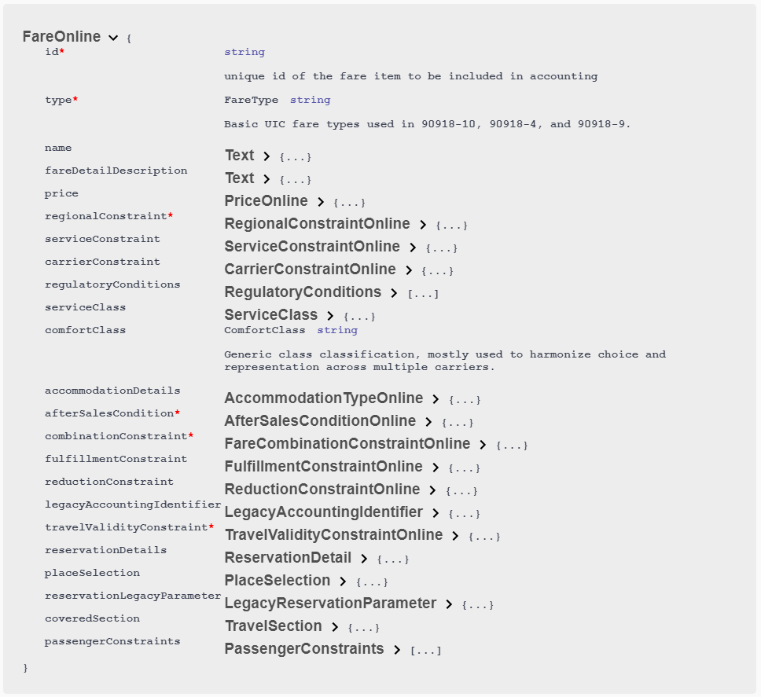

*Note: to be released with version 1.1*

The entities `offer`, `offerpart`, `product`and `fare` represent different concepts.

An `offer` spans the whole trip consisting of segments. An `offerpart` spans a
segment or - in the case of thru fares - multiple segments. An `offerpart`
reference one or two products, whereas two products are only referenced
in some rare TGV-TER scenarios.

A `fare` is not necessarily bound to segments but reflects the tariff
worlds. A `fare` often starts or ends at country borders where no train station exist.
This border points are thus called virtual border points. Fares are
combined following the fare combination models to offers.

## Ways to Access Fare

There are three ways for an allocator to access fares.

### First Scenario: Complete Offline Import of Fares

An allocator imports all fares of a given railway using a batch import from
the OSDM-Offline platform.

The fares contain all relevant information to create offers, bookings
and fulfillments (aka. tickets). If a booking occurs the RU informs
the RU of the fare sold using UIC 301.

### Second Scenario: Import of Relevant Fares at Offer Step

At offer time, an allocator looks up the fares for a given origin/destination
in its database. If it doesn't find it the allocator imports the relevant
fares online. If a booking occurs the RU informs the RU of the fare sold using UIC 301.

### Third Scenario: No Explicit Import of Fares

For a given origin/destination and date of travel the relevant fares are
returned as part of the `Offer`.

If the fare is sold as part of an offer then the fare is booked online at the offering
allocator.

## Attributes of an Online Fare

## Roles of Fare Attributes in the Booking and After Sales Processes

The fare contains all information so that an allocator can calculate correct prizes,
render a valid fulfillment and account correctly.

The following sections describe which fare attributes are used at which step:

### Offer Creation Step

Relevant fare attributes for the offer creation step are:

- `price`

- `regionalConstraint`
  
  Examples: a list of stations, a list of zones or a list of train link,...

  An allocator needs to guarantee that the whole trip is covered by fares.

- `serviceConstraint`

  Examples: `IC`, `TGV`, `BEX`, ...

  An allocator can create offers only if the trip/segment is run by the service.

- `carrierConstraint`

  Examples: Thalys, Eurostar, ...

  An allocator can create offers only if the trip/segment is run by the carrier.

- `regulatoryConditions`

  Examples: `CIV`, `MD` or `EU-PER`

  The regulatory conditions need to be indicated in the offer to inform the customer.

- `serviceClass`

  Examples: `HIGH`, `BEST`, `STANDARD` or `BASIC`

  The service class needs to be indicated in the offer to inform the customer.

- `comfortClass`

  Examples: `FIRST` or `SECOND`

  The comfort class needs to be indicated in the offer to inform the customer.

- `accommodationDetails`

  Example: `SEAT`, `COUCHETTE`, `BERTH` or `VEHICLE`

  If the train is a night train the accommodation details need to reflected in the offer.

- `afterSalesCondition`

  Example: Non-refundable after departure.

  The refund/exchange conditions need to be indicated in the offer to inform the customer.

- `serviceLevel`
  
  TODO: Missing in fare, add!

- `combinationConstraint`

  Examples: `SEPARATE_CONTRACTS` model, `SEPARATE_TICKETS` model, `CLUSTERING` model or `COMBINATION` model

  An allocator can only combine fares respecting the combination models.

- `fulfillmentConstraint`

  Examples: `SIP`, `SID` or `SIS`

  An allocator can only create offers which respect the constraints concerning the ticket control.

- `reductionConstraint`

  Example: `GA`, `Bahncard50`, ...

  An allocator can create offers only if the passenger(s) own the reduction(s).

- `travelValidityCondition`

  Example: Valid 24h after departure

  The validity needs to be communicated in the offer to inform the customer.

- `placeSelection`
  
  TODO

- `coveredSection`

  Example: Start and end location

  An allocator has to cover the whole trip from start to end location.

- `passengerConstraints`

  Example: Age between 6 and 16 years

  An allocator can only create offers respecting the age of the passenger(s).

### Pre-Booking Step

Fare attributes are not relevant for the pre-booking process step.

### Booking Step

Fare attributes are not relevant for the booking process step.

### Fulfillment Step

Relevant fare attributes for this process step are:

- `regionalConstraint`
  
  The regional constraint need to be communicated to the passenger(s), e.g. printed on the ticket.

- `regulatoryConditions`

  The regulatory conditions need to be communicated to the passengers(s), e.g. printed on the ticket.

- `serviceClass`

  The service class need to be communicated to the passengers(s), e.g. printed on the ticket.

- `travelValidityConstraint`

  The date are needed to create valid barcode and control data.

- `reservationDetails`

  The reserved places have to be communicated to the passengers(s), e.g. printed on the ticket.

### Accounting Step

Relevant fare attribute for the accounting step are:

- `price`

- `legacyAccountingIdentifier`

  The legacy accounting identifier information is used to right a correct 301 record.

## After Sale

### Refund Offer Creation Step

Relevant fare attributes for the creation of a refund offer are:

- `price`

- `afterSaleConditions`

  An allocator can create offers only if the after sale condition support its creation.

### Exchange Offer Creation Step

Relevant fare attributes for the creation of a refund offer are the `afterSaleConditions`
as well as all the attributes for offer creation.
